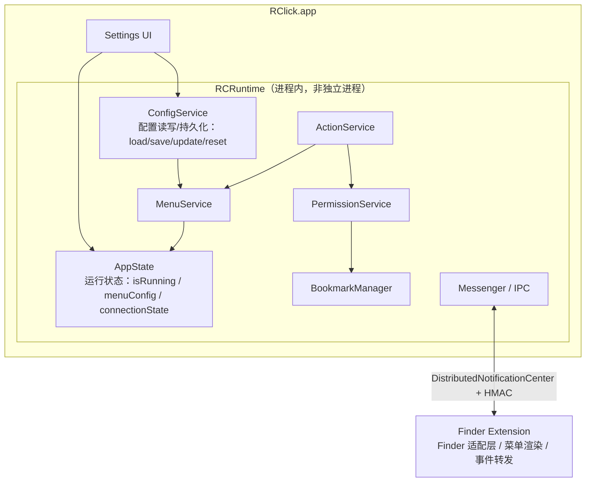

# RClick v2.2.0 重构计划（沙盒 App Store 方向 · 双进程 + 进程内 RCRuntime）

> 状态：已通过两轮评审（apple-ecosystem-expert + 架构评审）；**A–E 实施完成**（Phase A 分层 / B 回归 / C 沙盒 / D 授权打磨），剩余交互式 Finder 回归待手动验证
> 来源：开发者头脑风暴 + [v2.2.0-重构想法.md](v2.2.0-重构想法.md) 建议评估
> 日期：2026-08-23

## 最重要的前提（写给未来所有 Agent）

> **双进程 = Main App + Finder Extension。RCRuntime 是 Main App 进程内部的架构层，不是独立进程 / Helper。**
> 不要把它理解成 `RClickRuntime.app`。绝不因此引入第三进程（V2 不解决"Main App 退出后仍工作"的需求，无需求无抽象）。

---

## Context

- **上架目标 = Mac App Store** → 主 app 与扩展**必须全沙盒**，security-scoped bookmark 是唯一文件夹授权途径（已实现，只打磨不推翻）。
- **否决三进程 Helper/Runtime 架构**：MAS 下所有进程必须沙盒，"非沙盒 helper"不可能；且"用户主动退出 app 后右键仍可用"非需求。
- **采纳"双进程 + 进程内 RCRuntime"**：Main App 内部按 Runtime 服务层组织，业务逻辑单一所有者，Extension 保持薄 Finder 适配层。
- 语言切换早已删除（`22dd287`）；登录启动失效是 bug（`796d07f`）。

## 最终架构

## 评审采纳清单

| # | 意见 | 采纳 |
|---|------|------|
| 1 | 明确 RCRuntime 是进程内 Runtime，非独立 Helper | ✅ 见上方"最重要的前提" |
| 2 | heartbeat 不是可靠性机制；真存活判断 = 能否完成一次请求 | ✅ 重构 C 块（见 C） |
| 3 | BookmarkManager 上再加 PermissionService 层 | ✅ E3 |
| 4 | ActionService 避免变成第二个 God Object，但不过度拆分 | ✅ E2 |
| 5 | AppState 与 ConfigService 分离 | ✅ E4 |
| 6 | 删掉 ScriptService 占位（无需求无抽象） | ✅ 已移除 |
| 7 | 沙盒单独作为高风险 Phase，不混合重构 | ✅ 执行顺序 |
| 8 | 增加完整 Bookmark 回归测试矩阵 | ✅ 验证节 |
| 9 | 补 `network.client` entitlement | ✅ D1 |
| 10 | Updater 与 MAS 冲突，MAS 版删自更新 | ✅ D4 |
| 11 | `.quit` 立即置离线 + 线程安全 | ✅ C |
| 12 | 常用目录添加时即存 bookmark（根因修复） | ✅ B4 |

---

## A. 修复登录启动

**现状**：工作区已恢复 `LaunchAtLogin.Toggle` + `migrateLegacyLaunchAtLoginSetting()`（方向对）。

**改动**：
1. `LaunchAtLogin.swift` — 补警告 UI：处理 `SMAppService.mainApp.status` 全部非 `.enabled` 情形（`.requiresApproval`/`.notRegistered`/`.notFound`），覆盖"需装 /Applications"与"需用户批准"两种文案。
2. `GeneralSettingsTabView.swift` — 登录项 footer：开关开且 status 非 `.enabled` 时显示提示。
3. Debug 处理：`Bundle.main.bundlePath.hasPrefix("/Applications")` 快速短路 + status 兜底，避免 DerivedData 下假装成功。

---

## B. 打磨 bookmark 授权体验

1. `BookmarkManager.restoreBookmarks` — 区分失效：**resolve 抛错** → 删 `BookmarkEntity`；**`startAccessing` 返回 false** → 不立即删（外置盘未挂载等临时失败），重试一次或跳过。
2. `promptForPermission` — 优化 NSOpenPanel 文案（为何需要 / 可选更上层覆盖更多 / 可在设置管理）。同步 `Localizable.xcstrings`（en/zh-Hans/ja/es）。
3. `FolderPermissionsSheetView` — 行显示文件夹名 + 路径 + "包含所有子文件夹"；改进空状态。
4. **常用目录根因修复** — `CommonDirsSettingTabView` 添加目录时**即 `saveBookmark`**，避免沙盒下 openCommonDirs 每次点击都弹授权。

---

## C. 扩展离线 → 连接状态 UX + 操作失败明确提示

**原则**：**"进程活着 ≠ IPC 可用"**。heartbeat/超时**不是可靠性机制**，只是"连接状态缓存 + UX 优化"；真正的存活判断 = **能否完成一次请求**。

**改动**（`FinderSyncExt/FinderSyncExt.swift`）：
1. **连接状态缓存（UX 层）**：`lastMainActivity` 在收到 `.menuConfig`/`.running` 时更新；`connectionState = Date().timeIntervalSince(lastMainActivity) < 30` 时视为"在线"。菜单降级基于此缓存（离线 → 单个置灰项"RClick is not running" + 副标题"启动 RClick 后菜单自动恢复"，本地化，优先级高于 "loading…"）。这只决定**菜单展示**，不决定操作成败。
2. **点击时的真实判断**：用户点击动作时——
   - 若 `connectionState == offline` → 直接本地 Alert "RClick 未运行，无法执行该操作"（不静默失败）。
   - 若在线但实际无响应 → 加轻量 **ack**：主 app 收到 `.click` 后回 `.actionAck`；扩展发 click 后设短超时（~3s），未收到 ack → Alert "操作未执行，RClick 无响应"。⚠️ 需在 `Messager` 协议加 `actionAck` 消息（主 app → 扩展）。
3. **`.quit` 处理器立即置 offline**（消除"退出后 30s 假活"，现在 `.quit` 只记日志）。
4. **线程安全**：`lastMainActivity` 统一主线程读写（或加锁），Swift 6 下 DNC 回调线程写、`menu(for:)` 主线程读必须显式同步。
5. 主 app 恢复后 ~10s 内菜单自动恢复。

---

## D. App Store 合规 + 清理

### D0. 开启主 app 沙盒（独立高风险 Phase，见执行顺序）
- `project.pbxproj` — 主 app Debug & Release `ENABLE_APP_SANDBOX = YES`。
- ⚠️ 回归重点：沙盒下 bookmark 是唯一访问通道。`openApp`/`openCommonDirs` 未做门控 → E2 一并补（showAirDrop 已门控）。`openApp` 的 WezTerm 硬编码 hack 沙盒下失效，删除。

### D1. entitlements 清理
- `RClick.entitlements` — 加 `com.apple.security.app-sandbox = true` 和 **`com.apple.security.network.client`**（Updater GitHub API 必需）；**删** `temporary-exception.files.home-relative-path.read-write` 与 `temporary-exception.apple-events`（已验证无 Apple Events 发送代码）。保留 app-groups、bookmarks.app-scope、user-selected.read-write。
- `RClickDebug.entitlements` — 与 Release 对齐（当前缺 `user-selected.read-write`，沙盒 Debug 授权会失效）。
- `project.pbxproj` — 移除 `ENABLE_USER_SELECTED_FILES = readonly`（冲突）。
- 更新 `design-bookmark-permission.md`"保持不变"一节。

### D2. 死代码清理
- `MessageSecurity.swift` — 删 `SenderValidator`（死代码、bundle ID 错、DNC 无可靠发送者标识）。保留 HMAC。
- `Messager.swift` — 删未接线的 `respondMenuConfigRequest`；**加 `actionAck` 消息**（配合 C2）。

### D3. 过期文档更新
- `CLAUDE.md` — 修正 PermDir→BookmarkEntity、Models.swift→各实体、`RClick.MessageFromFinder/MessageFromApp`→`RClick.MainToExtension`/`RClick.ExtensionToMain`、MenuItemClickable.swift→已删、目录结构。
- `重构设计.md` — 标注 FDA 方向已被 `design-bookmark-permission.md` 取代。
- `README.md`/`SECURITY.md` — FDA→文件夹访问 bookmark 措辞。

### D4. Updater 与 MAS 冲突
- `Updater.swift` 用 `Process(unzip)` + 自替换 /Applications bundle，MAS 审核违规（app 只能经 App Store 更新）。
- **MAS 版**：删自更新，改"打开 Mac App Store 页面"；**Developer ID 版**：保留。
- 用 build config / 编译宏隔离（如 `#if !APPSTORE`），不简单删代码。

### D5. Info.plist 审核准备
- 加 `LSApplicationCategoryType`。
- 不设 `NSSupportsSuddenTermination`（避免猝死导致 `.quit` 不投递，破坏 C 块）。

### D6. MAS 审核说明文案准备
给审核员准备两点说明（提交时附上）：
1. **全盘监听**：扩展通过 `FIFinderSyncController.directoryURLs = ["/"]` 监听所有可达目录，是为了让 RClick 右键菜单出现在任意文件夹/磁盘（含外接盘）。FinderSync 扩展只能被 Finder 调用、不能后台常驻，不涉及用户隐私数据收集。
2. **辅助功能 + 模拟按键**：`createFile` 后使用 Accessibility API + `CGEvent` 模拟一次回车触发 Finder 重命名，仅在新文件创建那一刻生效，需要用户在"隐私与安全性 → 辅助功能"中授权，无持续监听。

---

## E. 进程内 RCRuntime 分层（Phase A 主体）

**改动**（新文件放 `RClick/Runtime/`，经 FileSystemSynchronizedRootGroup 自动进主 app target）：

1. **E1 `MenuService`** — 抽 `RClickApp.swift:210-239` 菜单配置构建为 `MenuService.buildConfig(state:) -> MenuConfigPayload`。
2. **E2 `ActionService`** — 抽 `actionHandler`/`copyPath`/`deleteFoldorFile`/`hideFilesAndDirs`/`unhideFilesAndDirs`/`showAirDrop`/`createFile`/`openApp`/`openCommonDirs` 等。**避免变成 God Object**：第一版用"Service + 私有方法 + `// MARK:` 分组（FileActions / AppActions / FinderActions / SystemActions）"，**不建十几个 Protocol、不拆细类**。依赖 `AppState`（只读状态）+ `PermissionService`（经协议注入）。openApp 门控：先尝试 `NSWorkspace.open`、completion 报错再弹授权重试；顺带修 `URL(fileURLWithPath: isDirectory: true)` 把文件当目录的 pre-existing bug。
3. **E3 `PermissionService` 层（评审必改）** — ActionService 不直接依赖 `BookmarkManager`。新增 `PermissionService`（暴露 `hasAccess`/`promptForPermission`/`saveBookmark`），内部委托 `BookmarkManager`。抽协议 `PermissionProviding`，注入 mock 以可测。**理由**：今天实现是 Security-Scoped Bookmark，明天可能是 User Selected/Container，V3 非沙盒可能是 Direct File Access —— ActionService 不应感知实现。
4. **E4 `ConfigService` 与 `AppState` 分离（评审必改）** — `AppState` = 运行状态（isRunning / menuConfig / connectionState）；`ConfigService` = 配置读写/持久化（load/save/update/reset，含 SwiftData 操作）。把现 `AppState` 里的 load/save/reindex 逻辑迁到 `ConfigService`。
5. **E5 `RCRuntime` 聚合** — 只做依赖容器/惰性初始化，持有 AppState / ConfigService / MenuService / ActionService / PermissionService / Messenger。**不是新的 God Object**，AppDelegate 按需取。
6. **E6 `ScriptService`：不做（评审必改）** — 脚本功能未实现，不建占位。等真正做脚本时再加。保持"没有需求就没有抽象"。
7. **E7 `Messager` 数据竞争修复** — handler 字典 `nonisolated(unsafe)` 可变字典，主线程写、DNC 回调线程读，Swift 6 下加锁或 mailbox。

**可测性**：`PermissionProviding` + `ActionStateProviding`（getAppItem/getActionItem/getFileType）协议注入 mock；文件操作用临时目录 fixture；`hasAccess` 前缀匹配单独单测。

---

## 执行顺序（沙盒单独成 Phase）

1. **Phase A — 纯代码分层（不动沙盒）**：E（MenuService/ActionService/PermissionService/ConfigService/RCRuntime/Messager 数据竞争）→ A（登录）→ D2/D3（死代码 + 文档）。此阶段**非沙盒行为必须完全不变**。
2. **Phase B — 验证非沙盒行为不变**：现有全部功能回归（文件操作、菜单、授权、登录）。
3. **Phase C — 建立沙盒 build（高风险，单独）**：D0（开沙盒）→ D1（entitlements 含 network.client）→ D4（Updater 隔离）→ D5（Info.plist）→ D6（审核说明）。
4. **Phase D — 沙盒下逐项验证文件操作**：跑测试矩阵 + B（授权打磨 + 常用目录根因）。

---

## 验证（端到端）

**Bookmark 回归测试矩阵**（沙盒构建，Phase D 逐项跑）：

| 场景 \ 状态 | 未授权 | 已授权 | 重启后 |
|---|---|---|---|
| Desktop（TCC 保护） | ❌ 弹授权 | ✅ | ✅ |
| Documents | ❌ 弹授权 | ✅ | ✅ |
| Downloads | ❌ 弹授权 | ✅ | ✅ |
| 自定义文件夹 | ❌ 弹授权 | ✅ | ✅ |
| 子目录（继承父授权） | 继承 | ✅ | ✅ |
| 多选文件 | ❌ 弹授权 | ✅ | ✅ |
| 删除 | ❌ | ✅ | ✅ |
| 新建 | ❌ | ✅ | ✅ |
| 隐藏/显示 | ❌ | ✅ | ✅ |
| 打开 App（openApp 门控） | ❌ | ✅ | ✅ |
| 常用目录打开 | 添加时即授权 | ✅ | ✅ |

> 重点：**bookmark 重启后是否仍有效**是沙盒架构最关键的单测。

其他验证：
- **构建**：`xcodebuild -project RClick.xcodeproj -scheme RClick -destination 'platform=macOS'`（沙盒配置，无警告/错误）。
- **登录**：装 /Applications → 开登录项 → 重启生效；Xcode 跑 → 提示"需装 /Applications / 需批准"。
- **降级**：退出主 app → **立即**置灰 + 点击弹"RClick 未运行"；杀主 app → ≤30s 置灰；在线但 ack 超时 → "操作未执行"提示；重启 → ~10s 恢复。
- **Updater**：MAS 版无自更新、跳 App Store；Developer ID 版自更新可用（network.client 下）。
- **分层**：ActionService 单测（mock PermissionProviding/ActionStateProviding）通过；Phase A 后 AppDelegate 瘦身、非沙盒行为零回归。
- **合规**：Archive 沙盒配置跑 App Store 校验（无 temporary-exception、含 network.client）。
